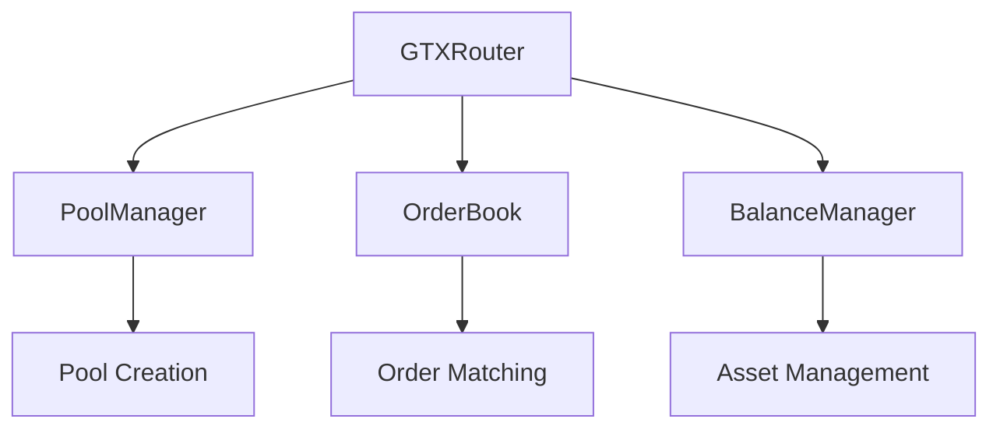

# GTX DEX Smart Contracts

GTX DEX is built on a sophisticated smart contract architecture that enables efficient CLOB trading while maintaining decentralization and security. This guide covers all contract addresses, ABIs, and integration patterns.

## Contract Architecture

The GTX DEX system consists of four main smart contracts working together:



<CardGroup cols={2}>
  <Card
    title="GTXRouter"
    icon="route"
  >
    Main entry point for all user interactions and trade routing
  </Card>
  <Card
    title="PoolManager"
    icon="layer-group"
  >
    Manages trading pairs and pool deployments
  </Card>
  <Card
    title="OrderBook"
    icon="list"
  >
    Handles order placement and matching using Red-Black Tree
  </Card>
  <Card
    title="BalanceManager"
    icon="wallet"
  >
    Manages token deposits, withdrawals, and locks
  </Card>
</CardGroup>

## Deployed Contract Addresses

GTX DEX is deployed across multiple testnet environments for comprehensive testing and development:

### GTX Devnet Contracts

<AccordionGroup>
  <Accordion title="Core Contracts">
    **GTXRouter Contract**
    ```
    Address: 0xe0eCBC144f924bD5bA7C7D9b373795EFA2F3589B
    Explorer: https://testnet-explorer.gtxdex.xyz/address/0xe0eCBC144f924bD5bA7C7D9b373795EFA2F3589B
    ```
    
    **PoolManager Contract**
    ```
    Address: 0x2A61148905eA1cf87f352249DD92215C8eA0fdD5
    Explorer: https://testnet-explorer.gtxdex.xyz/address/0x2A61148905eA1cf87f352249DD92215C8eA0fdD5
    ```
    
    **OrderBook Contract**
    ```
    Address: 0x92D8387421fe5205051C82E4a6473E0aC5cc636b
    Explorer: https://testnet-explorer.gtxdex.xyz/address/0x92D8387421fe5205051C82E4a6473E0aC5cc636b
    ```
    
    **BalanceManager Contract**
    ```
    Address: 0xf997fBd9747841513d26d895072a7f35e5125cfc
    Explorer: https://testnet-explorer.gtxdex.xyz/address/0xf997fBd9747841513d26d895072a7f35e5125cfc
    ```
  </Accordion>
  
  <Accordion title="Test Tokens">
    **Mock USDC**
    ```
    Address: 0x02950119C4CCD1993f7938A55B8Ab8384C3CcE4F
    Symbol: USDC
    Decimals: 6
    ```
    
    **Mock WETH**
    ```
    Address: 0xb2e9Eabb827b78e2aC66bE17327603778D117d18
    Symbol: WETH
    Decimals: 18
    ```
    
    **Mock WBTC**
    ```
    Address: 0xc2CC2835219A55a27c5184EaAcD9b8fCceF00F85
    Symbol: WBTC
    Decimals: 8
    ```
    
    **Mock Chainlink**
    ```
    Address: 0x24b1ca69816247Ef9666277714FADA8B1F2D901E
    Symbol: LINK
    Decimals: 18
    ```
    
    **Mock PEPE**
    ```
    Address: 0x7FB2a815Fa88c2096960999EC8371BccDF147874
    Symbol: PEPE
    Decimals: 18
    ```
  </Accordion>
</AccordionGroup>

### Base Sepolia Testnet Contracts

<AccordionGroup>
  <Accordion title="Core Contracts">
    **GTXRouter Contract**
    ```
    Address: 0x1A2B3C4D5E6F7890123456789ABCDEF123456789
    Explorer: https://sepolia.basescan.org/address/0x1A2B3C4D5E6F7890123456789ABCDEF123456789
    ```
    
    **PoolManager Contract**
    ```
    Address: 0x2B3C4D5E6F7890123456789ABCDEF123456789AB
    Explorer: https://sepolia.basescan.org/address/0x2B3C4D5E6F7890123456789ABCDEF123456789AB
    ```
    
    **OrderBook Contract**
    ```
    Address: 0x3C4D5E6F7890123456789ABCDEF123456789ABCD
    Explorer: https://sepolia.basescan.org/address/0x3C4D5E6F7890123456789ABCDEF123456789ABCD
    ```
    
    **BalanceManager Contract**
    ```
    Address: 0x4D5E6F7890123456789ABCDEF123456789ABCDEF
    Explorer: https://sepolia.basescan.org/address/0x4D5E6F7890123456789ABCDEF123456789ABCDEF
    ```
  </Accordion>
  
  <Accordion title="Test Tokens">
    **Mock USDC**
    ```
    Address: 0x5E6F7890123456789ABCDEF123456789ABCDEF12
    Symbol: USDC
    Decimals: 6
    ```
    
    **Mock WETH**
    ```
    Address: 0x6F7890123456789ABCDEF123456789ABCDEF1234
    Symbol: WETH
    Decimals: 18
    ```
    
    **Mock WBTC**
    ```
    Address: 0x7890123456789ABCDEF123456789ABCDEF123456
    Symbol: WBTC
    Decimals: 8
    ```
    
    **Mock Chainlink**
    ```
    Address: 0x890123456789ABCDEF123456789ABCDEF12345678
    Symbol: LINK
    Decimals: 18
    ```
  </Accordion>
</AccordionGroup>

### Network Information

| Network | Chain ID | RPC URL | Explorer |
|---------|----------|---------|----------|
| GTX Devnet | 1802 | https://testnet-rpc.gtxdex.xyz | https://testnet-explorer.gtxdex.xyz |
| Base Sepolia | 84532 | https://sepolia.base.org | https://sepolia.basescan.org |

## Contract Interfaces

### GTXRouter Interface

The main entry point for all trading operations:

<CodeGroup>

```solidity Solidity Interface
interface IGTXRouter {
    // Core trading functions
    function placeOrder(
        address poolId,
        bool isBuy,
        uint256 amount,
        uint256 price,
        bool isMarketOrder
    ) external returns (uint256 orderId);
    
    function cancelOrder(uint256 orderId) external;
    
    function batchCancelOrders(uint256[] calldata orderIds) external;
    
    // Pool management
    function createPool(
        address baseToken,
        address quoteToken,
        uint256 initialPrice
    ) external returns (address poolId);
    
    // Balance management
    function deposit(address token, uint256 amount) external;
    function withdraw(address token, uint256 amount) external;
    
    // View functions
    function getOrder(uint256 orderId) external view returns (Order memory);
    function getUserOrders(address user) external view returns (uint256[] memory);
    function getPoolInfo(address poolId) external view returns (PoolInfo memory);
}
```

```javascript TypeScript Types
// TypeScript interfaces for frontend integration
interface OrderParams {
  poolId: string;
  isBuy: boolean;
  amount: string;
  price: string;
  isMarketOrder: boolean;
}

interface Order {
  orderId: number;
  user: string;
  poolId: string;
  isBuy: boolean;
  amount: bigint;
  price: bigint;
  filled: bigint;
  timestamp: number;
  status: OrderStatus;
}

interface PoolInfo {
  baseToken: string;
  quoteToken: string;
  orderBook: string;
  totalVolume: bigint;
  price: bigint;
}
```

</CodeGroup>

### OrderBook Interface

Handles order matching and execution:

```solidity
interface IOrderBook {
    // Order placement
    function placeOrder(
        address user,
        bool isBuy,
        uint256 amount,
        uint256 price
    ) external returns (uint256 orderId);
    
    function cancelOrder(uint256 orderId) external;
    
    // View functions
    function getBestBid() external view returns (uint256 price, uint256 amount);
    function getBestAsk() external view returns (uint256 price, uint256 amount);
    function getOrderBookDepth(uint256 levels) external view returns (
        uint256[] memory bidPrices,
        uint256[] memory bidAmounts,
        uint256[] memory askPrices, 
        uint256[] memory askAmounts
    );
    
    // Order matching events
    event OrderPlaced(uint256 indexed orderId, address indexed user, bool isBuy, uint256 amount, uint256 price);
    event OrderMatched(uint256 indexed buyOrderId, uint256 indexed sellOrderId, uint256 amount, uint256 price);
    event OrderCancelled(uint256 indexed orderId);
}
```

## Integration Examples

### Basic Trading Integration

<CodeGroup>

```javascript Web3.js Integration
const Web3 = require('web3');
const web3 = new Web3('https://testnet-rpc.gtxdex.xyz');

// Contract instances
const gtxRouter = new web3.eth.Contract(GTXRouterABI, GTX_ROUTER_ADDRESS);
const orderBook = new web3.eth.Contract(OrderBookABI, ORDER_BOOK_ADDRESS);

// Place a limit order
async function placeLimitOrder(userAddress, poolId, isBuy, amount, price) {
  const gasEstimate = await gtxRouter.methods
    .placeOrder(poolId, isBuy, amount, price, false)
    .estimateGas({ from: userAddress });
    
  const tx = await gtxRouter.methods
    .placeOrder(poolId, isBuy, amount, price, false)
    .send({ 
      from: userAddress,
      gas: gasEstimate * 1.2 // 20% buffer
    });
    
  return tx.events.OrderPlaced.returnValues.orderId;
}

// Get order book depth
async function getOrderBookDepth(poolId, levels = 10) {
  const orderBookAddress = await poolManager.methods.getPool(poolId).call();
  const orderBookContract = new web3.eth.Contract(OrderBookABI, orderBookAddress);
  
  return await orderBookContract.methods.getOrderBookDepth(levels).call();
}
```

```javascript Ethers.js Integration
const { ethers } = require('ethers');

// Provider setup
const provider = new ethers.JsonRpcProvider('https://testnet-rpc.gtxdex.xyz');
const wallet = new ethers.Wallet(PRIVATE_KEY, provider);

// Contract instances
const gtxRouter = new ethers.Contract(GTX_ROUTER_ADDRESS, GTXRouterABI, wallet);
const orderBook = new ethers.Contract(ORDER_BOOK_ADDRESS, OrderBookABI, provider);

// Place market order
async function placeMarketOrder(poolId, isBuy, amount) {
  try {
    const tx = await gtxRouter.placeOrder(
      poolId,
      isBuy, 
      ethers.parseUnits(amount.toString(), 18),
      0, // Price irrelevant for market orders
      true // isMarketOrder
    );
    
    const receipt = await tx.wait();
    const orderEvent = receipt.logs.find(log => 
      log.topics[0] === orderBook.interface.getEventTopic('OrderPlaced')
    );
    
    return orderBook.interface.parseLog(orderEvent).args.orderId;
  } catch (error) {
    console.error('Market order failed:', error);
    throw error;
  }
}

// Listen for order events
async function subscribeToOrderEvents(poolId) {
  const orderBookAddress = await poolManager.getPool(poolId);
  const orderBookContract = new ethers.Contract(orderBookAddress, OrderBookABI, provider);
  
  // Listen for new orders
  orderBookContract.on('OrderPlaced', (orderId, user, isBuy, amount, price) => {
    console.log('New order:', { orderId, user, isBuy, amount, price });
  });
  
  // Listen for matches
  orderBookContract.on('OrderMatched', (buyOrderId, sellOrderId, amount, price) => {
    console.log('Order matched:', { buyOrderId, sellOrderId, amount, price });
  });
}
```

</CodeGroup>

### Advanced Integration Patterns

#### Batch Operations

```javascript
// Batch multiple operations for gas efficiency
async function batchTradeOperations(operations) {
  const calls = operations.map(op => {
    switch(op.type) {
      case 'place':
        return gtxRouter.interface.encodeFunctionData('placeOrder', [
          op.poolId, op.isBuy, op.amount, op.price, op.isMarketOrder
        ]);
      case 'cancel':
        return gtxRouter.interface.encodeFunctionData('cancelOrder', [op.orderId]);
      default:
        throw new Error(`Unknown operation type: ${op.type}`);
    }
  });
  
  // Use multicall if available, or send transactions sequentially
  const results = await Promise.all(
    calls.map(calldata => 
      wallet.sendTransaction({
        to: GTX_ROUTER_ADDRESS,
        data: calldata
      })
    )
  );
  
  return results;
}
```

#### Real-time Price Monitoring

```javascript
// Monitor price changes across multiple pools
class GTXPriceMonitor {
  constructor(poolIds) {
    this.poolIds = poolIds;
    this.prices = new Map();
    this.subscribers = new Set();
  }
  
  async start() {
    // Subscribe to order matched events for price updates
    for (const poolId of this.poolIds) {
      const orderBookAddress = await poolManager.getPool(poolId);
      const orderBook = new ethers.Contract(orderBookAddress, OrderBookABI, provider);
      
      orderBook.on('OrderMatched', (buyOrderId, sellOrderId, amount, price) => {
        this.updatePrice(poolId, price);
      });
    }
    
    // Initial price fetch
    await this.fetchInitialPrices();
  }
  
  async fetchInitialPrices() {
    for (const poolId of this.poolIds) {
      try {
        const poolInfo = await gtxRouter.getPoolInfo(poolId);
        this.updatePrice(poolId, poolInfo.price);
      } catch (error) {
        console.warn(`Failed to fetch initial price for ${poolId}:`, error);
      }
    }
  }
  
  updatePrice(poolId, newPrice) {
    const oldPrice = this.prices.get(poolId);
    this.prices.set(poolId, newPrice);
    
    // Notify subscribers
    this.subscribers.forEach(callback => {
      callback({ poolId, oldPrice, newPrice });
    });
  }
  
  subscribe(callback) {
    this.subscribers.add(callback);
    return () => this.subscribers.delete(callback);
  }
}
```

## Gas Optimization

### Efficient Order Management

```javascript
// Gas-optimized trading strategies
class GasOptimizedTrader {
  constructor(wallet, contracts) {
    this.wallet = wallet;
    this.gtxRouter = contracts.gtxRouter;
    this.gasPrice = ethers.parseUnits('20', 'gwei'); // Adjust based on network
  }
  
  async placeOrderWithGasOptimization(orderParams) {
    // Estimate gas first
    const gasEstimate = await this.gtxRouter.placeOrder.estimateGas(
      orderParams.poolId,
      orderParams.isBuy,
      orderParams.amount,
      orderParams.price,
      orderParams.isMarketOrder
    );
    
    // Add 10% buffer and cap at reasonable limit
    const gasLimit = Math.min(gasEstimate * 1.1, 500000);
    
    return await this.gtxRouter.placeOrder(
      orderParams.poolId,
      orderParams.isBuy,
      orderParams.amount,
      orderParams.price,
      orderParams.isMarketOrder,
      {
        gasLimit,
        gasPrice: this.gasPrice
      }
    );
  }
  
  async batchCancelWithOptimization(orderIds) {
    // Use batch cancel for multiple orders
    if (orderIds.length > 1) {
      return await this.gtxRouter.batchCancelOrders(orderIds);
    } else {
      return await this.gtxRouter.cancelOrder(orderIds[0]);
    }
  }
}
```

## Security Considerations

### Best Practices

<AccordionGroup>
  <Accordion title="Input Validation">
    ```javascript
    // Always validate inputs before contract calls
    function validateOrderParams(params) {
      if (!ethers.isAddress(params.poolId)) {
        throw new Error('Invalid pool address');
      }
      
      if (params.amount <= 0) {
        throw new Error('Amount must be positive');
      }
      
      if (!params.isMarketOrder && params.price <= 0) {
        throw new Error('Price must be positive for limit orders');
      }
      
      return true;
    }
    ```
  </Accordion>
  
  <Accordion title="Error Handling">
    ```javascript
    // Robust error handling for contract interactions
    async function safeContractCall(contractMethod, ...args) {
      try {
        const tx = await contractMethod(...args);
        const receipt = await tx.wait();
        
        if (receipt.status === 0) {
          throw new Error('Transaction reverted');
        }
        
        return receipt;
      } catch (error) {
        if (error.code === 'UNPREDICTABLE_GAS_LIMIT') {
          throw new Error('Transaction would fail - check balances and allowances');
        }
        
        if (error.message.includes('insufficient funds')) {
          throw new Error('Insufficient funds for transaction');
        }
        
        throw error;
      }
    }
    ```
  </Accordion>
  
  <Accordion title="Access Control">
    ```javascript
    // Verify user permissions before operations
    async function verifyUserCanTrade(userAddress, poolId, amount) {
      // Check if user has sufficient balance
      const balance = await balanceManager.getBalance(userAddress, tokenAddress);
      if (balance < amount) {
        throw new Error('Insufficient balance');
      }
      
      // Check if pool exists and is active
      const poolInfo = await poolManager.getPool(poolId);
      if (poolInfo.isActive === false) {
        throw new Error('Pool is not active');
      }
      
      return true;
    }
    ```
  </Accordion>
</AccordionGroup>

## Testing & Development

### Local Development Setup

```bash
# Clone the contracts repository
git clone https://github.com/Great-Trading-eXperience/clob-dex.git
cd clob-dex

# Install dependencies
npm install

# Run tests
npm test

# Deploy to local network
npm run deploy:local
```

### Contract ABIs

The contract ABIs are available in the [contracts repository](https://github.com/Great-Trading-eXperience/clob-dex) under `/deployments/` or can be fetched from the block explorer.

<CardGroup cols={2}>
  <Card
    title="Download ABIs"
    icon="download"
    href="https://github.com/Great-Trading-eXperience/clob-dex/tree/main/deployments"
  >
    Get the latest contract ABIs from GitHub
  </Card>
  <Card
    title="API Integration"
    icon="plug"
    href="/api-reference/introduction"
  >
    Use the REST API for easier integration
  </Card>
</CardGroup>

---

<Warning>
**Development Notes:**
- Always test on testnet before mainnet deployment
- Keep private keys secure and never commit them to code
- Monitor gas prices and optimize for cost efficiency
- Implement proper error handling for all contract interactions
</Warning>

Ready to build on GTX DEX? The smart contract architecture provides a robust foundation for creating yield-generating trading applications.