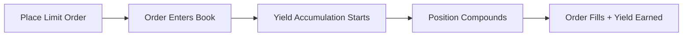
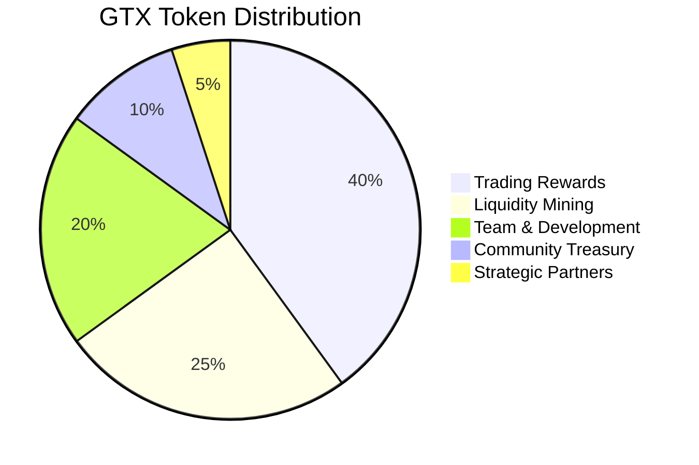

# Yield & Rewards on GTX DEX

GTX DEX revolutionizes DeFi by ensuring **every moment your capital is productive**. Unlike traditional exchanges where your assets sit idle, GTX provides multiple yield streams that work simultaneously with your trading activities.

## The GTX Yield Advantage

<CardGroup cols={2}>
  <Card
    title="Active Trading Yield"
    icon="coins"
  >
    Earn continuous returns on open trading positions and limit orders
  </Card>
  <Card
    title="Protocol Rewards"
    icon="gift"
  >
    Receive GTX tokens and trading fee rebates for platform participation
  </Card>
  <Card
    title="No Opportunity Cost"
    icon="clock"
  >
    Your capital works for you whether actively trading or holding positions
  </Card>
  <Card
    title="Compounding Returns"
    icon="trending-up"
  >
    All yield streams compound automatically for maximum growth
  </Card>
</CardGroup>

## How GTX Yield Works

### 🔄 **Active Trading Yield**

Every limit order and trading position generates yield automatically:



#### Yield Sources for Traders
- **Base Yield Rate** - Variable APY on order value
- **Position Yield** - Returns on held positions  
- **Order Book Participation** - Rewards for providing liquidity
- **Fee Rebates** - Portion of trading fees returned

### 💎 **Protocol Participation Rewards**

Earn GTX tokens through various platform activities:

<AccordionGroup>
  <Accordion title="Trading Volume Rewards">
    **Earn GTX tokens based on your trading activity**
    
    - Weekly distributions based on volume
    - Higher multipliers for consistent traders
    - Bonus rewards during promotional periods
    
    ```javascript
    // Example weekly distribution
    Your Trading Volume: $50,000
    Total Platform Volume: $10,000,000
    Weekly GTX Allocation: 1,000 GTX
    
    Your Share: (50,000 / 10,000,000) × 1,000 = 0.5 GTX tokens
    ```
  </Accordion>
  
  <Accordion title="Market Making Incentives">
    **Additional rewards for providing liquidity**
    
    - Higher GTX multipliers for limit orders
    - Maker fee rebates up to 50%
    - Special rewards for tight spreads
    
    ```javascript
    // Market maker bonus example
    Base Reward: 2 GTX tokens
    Market Maker Multiplier: 2x
    Tight Spread Bonus: 1.5x
    
    Total Reward: 2 × 2 × 1.5 = 6 GTX tokens
    ```
  </Accordion>
  
  <Accordion title="Early Adopter Rewards">
    **Bonus rewards for early platform users**
    
    - Retroactive rewards for beta users
    - Increased yield rates for early participants
    - Exclusive access to premium features
  </Accordion>
</AccordionGroup>

## Yield Rates & Performance

### Current Yield Opportunities

| Activity | Base APY | GTX Rewards | Total Return* |
|----------|----------|-------------|---------------|
| Active Trading | 3-8% | Variable | 5-15% |
| Market Making | 5-12% | 2x Multiplier | 8-20% |
| Long-term Positions | 2-5% | Standard | 3-8% |
| Cross-chain Deposits | 4-10% | 1.5x Multiplier | 6-18% |

<Note>
*Total returns are estimates and include yield plus GTX token rewards at current market prices. Actual returns may vary based on market conditions.
</Note>

### Yield Calculation Examples

#### Example 1: Day Trader
```javascript
// Active trader with frequent limit orders
Profile: 
- Daily trading volume: $10,000
- Average position time: 4 hours
- Order type: 70% limit orders

Daily Yield Calculation:
- Base yield: $10,000 × 6% APY × (4/24) hours = $1.00
- Trading rewards: 0.01% of volume = $1.00  
- Maker rebates: 30% of fees = $3.00

Total Daily Yield: ~$5.00
Annual Yield: ~$1,825 (18.25% on $10k average)
```

#### Example 2: Position Holder
```javascript
// Long-term holder with strategic positions
Profile:
- Position size: $50,000
- Hold duration: 30 days average
- Strategy: Buy and hold with yield

Monthly Yield Calculation:
- Base yield: $50,000 × 4% APY × (30/365) days = $164.38
- GTX rewards: Position value × 0.1% = $50.00
- Compound effect: Previous yields earn additional yield

Total Monthly Yield: ~$214.38
Annual Yield: ~$2,572 (5.14% on $50k)
```

## Maximizing Your Yields

### Strategy 1: Optimize Order Types

<Steps>
  <Step title="Favor Limit Orders">
    Use limit orders over market orders to earn yield while waiting for execution
  </Step>
  <Step title="Strategic Pricing">
    Price orders competitively but with enough buffer for yield accumulation
  </Step>
  <Step title="Longer Time Horizons">
    Let orders sit longer to maximize yield before fills
  </Step>
  <Step title="Diversify Positions">
    Spread orders across multiple price levels and timeframes
  </Step>
</Steps>

### Strategy 2: Market Making

```javascript
// Optimal market making setup
const strategy = {
  spread: 0.2, // 0.2% spread around mid price
  orderSize: 1000, // $1000 per order
  levels: 5, // 5 levels on each side
  refreshRate: 300 // Update every 5 minutes
};

// Expected yields:
// - Base yield on $10,000 total orders
// - 2x GTX multiplier for market making
// - Fee rebates on successful fills
// - Spread profit when both sides fill
```

### Strategy 3: Cross-Chain Opportunities

Take advantage of cross-chain yield differentials:

- **Deposit on high-yield chains** - Some networks offer higher base rates
- **Bridge during peak periods** - Enhanced rewards during high activity
- **Utilize yield farming** - Combine trading with DeFi protocols

## GTX Token Economics

### Token Utility

GTX tokens provide multiple benefits within the ecosystem:

<CardGroup cols={3}>
  <Card
    title="Fee Discounts"
    icon="percent"
  >
    Stake GTX to reduce trading fees up to 25%
  </Card>
  <Card
    title="Yield Boosters"
    icon="rocket"
  >
    Holding GTX increases base yield rates
  </Card>
  <Card
    title="Governance Rights"
    icon="vote-yea"
  >
    Vote on protocol parameters and fee structures
  </Card>
</CardGroup>

### Staking Benefits

| GTX Staked | Fee Discount | Yield Boost | Governance Weight |
|------------|--------------|-------------|-------------------|
| 0 GTX | 0% | 1.0x | 0 votes |
| 100+ GTX | 5% | 1.1x | Standard |
| 1,000+ GTX | 10% | 1.25x | Enhanced |
| 10,000+ GTX | 15% | 1.5x | Premium |
| 100,000+ GTX | 25% | 2.0x | Whale |

### Token Distribution



## Yield Tracking & Analytics

### Real-Time Yield Dashboard

Monitor your earnings through the GTX DEX interface:

```javascript
// Access yield analytics
const yieldStats = await gtx.getUserYieldStats(userAddress);

console.log("Current yield rate:", yieldStats.currentAPY);
console.log("Total earned this month:", yieldStats.monthlyEarnings);
console.log("GTX rewards pending:", yieldStats.pendingGTX);
console.log("Fee rebates earned:", yieldStats.rebatesEarned);
```

### Yield Optimization Tools

#### Yield Calculator
```javascript
function calculateProjectedYield(params) {
  const { 
    positionSize, 
    timeFrame, 
    activityLevel, 
    gtxStaked 
  } = params;
  
  // Base rates vary by activity
  const baseRates = {
    high: 0.08,    // 8% for active traders
    medium: 0.05,  // 5% for regular users  
    low: 0.03      // 3% for holders
  };
  
  const baseRate = baseRates[activityLevel];
  const gtxMultiplier = calculateGTXBoost(gtxStaked);
  
  const annualYield = positionSize * baseRate * gtxMultiplier;
  const periodYield = annualYield * (timeFrame / 365);
  
  return {
    annualYield,
    periodYield,
    effectiveAPY: baseRate * gtxMultiplier * 100
  };
}
```

#### Performance Tracking
```javascript
// Track yield performance over time
const yieldHistory = await gtx.getYieldHistory(userAddress, '30d');

const analysis = {
  totalEarned: yieldHistory.reduce((sum, day) => sum + day.yield, 0),
  averageDaily: yieldHistory.length > 0 ? 
    totalEarned / yieldHistory.length : 0,
  bestDay: Math.max(...yieldHistory.map(d => d.yield)),
  consistency: calculateConsistencyScore(yieldHistory)
};
```

## Advanced Yield Strategies

### Compound Yield Strategy

```javascript
// Automatically reinvest yields for compounding
const compoundStrategy = {
  // Reinvest yields when they reach threshold
  reinvestThreshold: 100, // $100
  
  // Compound frequency
  frequency: 'weekly',
  
  // Reinvestment allocation
  allocation: {
    trading: 0.7,    // 70% back to trading
    staking: 0.2,    // 20% to GTX staking  
    reserves: 0.1    // 10% kept as reserves
  }
};
```

### Risk-Adjusted Yield

Balance yield generation with risk management:

<AccordionGroup>
  <Accordion title="Conservative Strategy">
    **Focus on stable, lower-risk yields**
    
    - Longer-term limit orders
    - Major trading pairs only
    - Conservative position sizing
    - Target: 3-6% annual yield
  </Accordion>
  
  <Accordion title="Balanced Strategy">
    **Mix of stability and growth**
    
    - Diversified order timeframes
    - Mix of major and emerging pairs
    - Moderate leverage usage
    - Target: 6-12% annual yield
  </Accordion>
  
  <Accordion title="Aggressive Strategy">
    **Maximum yield with higher risk**
    
    - High-frequency trading
    - Emerging and volatile pairs
    - Active market making
    - Target: 12-25% annual yield
  </Accordion>
</AccordionGroup>

## Yield Security & Risks

### Risk Factors

<Warning>
**Important Yield Considerations:**
- Yield rates are variable and not guaranteed
- Market volatility can affect both yields and principal
- Smart contract risks exist in all DeFi protocols
- Impermanent loss doesn't apply (no LP tokens), but market risk does
- High activity may increase gas costs
</Warning>

### Security Measures

GTX DEX implements multiple security layers:

- **Audited Smart Contracts** - Multiple security audits completed
- **Decentralized Architecture** - No central points of failure  
- **Transparent Yield Calculation** - All rates calculated on-chain
- **User-Controlled Keys** - Non-custodial design maintains user control

## Getting Started with Yield

<Steps>
  <Step title="Connect & Deposit">
    Connect your wallet and deposit trading capital
  </Step>
  <Step title="Start Trading">
    Place limit orders to begin earning yield immediately
  </Step>
  <Step title="Optimize Strategy">
    Monitor performance and adjust approach based on results
  </Step>
  <Step title="Stake GTX">
    Acquire and stake GTX tokens for additional benefits
  </Step>
  <Step title="Track Performance">
    Use analytics to optimize your yield generation
  </Step>
</Steps>

---

<Info>
**Ready to start earning?** GTX DEX transforms every trade into a yield-generating opportunity. Your capital works continuously, whether you're actively trading or holding positions.
</Info>