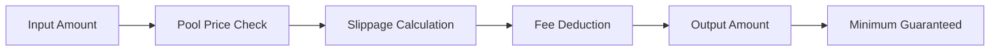

# Token Swap

GTX DEX provides a comprehensive token swap interface that allows users to exchange between supported tokens with optimal rates, minimal slippage, and real-time price updates.

## Overview

The swap feature enables direct token-to-token exchanges using GTX DEX's liquidity pools, providing:

- **Best Exchange Rates** - Automatic routing for optimal pricing
- **Minimal Slippage** - Built-in slippage protection (0.3% default)
- **Real-time Pricing** - Live price updates and balance checking
- **Gas Optimization** - Efficient transaction execution
- **Yield Integration** - Swapped tokens can immediately earn yield

## How Swapping Works

<CardGroup cols={2}>
  <Card
    title="Price Discovery"
    icon="search-dollar"
  >
    Real-time price calculation using on-chain liquidity pools
  </Card>
  <Card
    title="Slippage Protection"
    icon="shield-check"
  >
    Automatic slippage tolerance to protect against price movements
  </Card>
  <Card
    title="Instant Settlement"
    icon="bolt"
  >
    Direct on-chain execution with immediate token delivery
  </Card>
  <Card
    title="Fee Transparency"
    icon="eye"
  >
    Clear fee breakdown (0.2% swap fee) with no hidden costs
  </Card>
</CardGroup>

## Supported Tokens

GTX DEX supports swapping between all tokens available in the trading pools:

### Available Trading Pairs

| Token | Symbol | Network | Description |
|-------|--------|---------|-------------|
| **Wrapped Ethereum** | WETH | GTX Devnet | Primary base asset |
| **USD Coin** | USDC | GTX Devnet | Stable quote currency |
| **Wrapped Bitcoin** | WBTC | GTX Devnet | Bitcoin representation |
| **Chainlink** | LINK | GTX Devnet | Oracle token |
| **Pepe** | PEPE | GTX Devnet | Meme token |

<Note>
The available token list is dynamically loaded from active trading pools, ensuring only liquid pairs are available for swapping.
</Note>

## Using the Swap Interface

### Step-by-Step Guide

<Steps>
  <Step title="Connect Wallet">
    Connect your wallet (MetaMask, Privy embedded, or other Web3 wallets)
  </Step>
  <Step title="Select Source Token">
    Choose the token you want to swap from the dropdown menu
  </Step>
  <Step title="Enter Amount">
    Input the amount you want to swap - balance information shown in real-time
  </Step>
  <Step title="Select Destination Token">
    Choose the token you want to receive
  </Step>
  <Step title="Review Details">
    Check exchange rate, fees, and minimum received amount
  </Step>
  <Step title="Execute Swap">
    Confirm the transaction in your wallet
  </Step>
</Steps>

### Interface Features

<AccordionGroup>
  <Accordion title="Token Selection">
    **Smart Token Picker**
    
    - Visual token icons for easy identification
    - Real-time balance display
    - Auto-detection of wallet holdings
    - Swap direction reversal with one click
    
    ```javascript
    // Example token selection
    {
      sourceToken: "WETH",
      destToken: "USDC", 
      amount: "1.5"
    }
    ```
  </Accordion>
  
  <Accordion title="Price Calculation">
    **Real-time Price Updates**
    
    - Live exchange rate calculation
    - USD value estimation
    - Slippage-adjusted minimum output
    - Impact assessment for large trades
    
    ```javascript
    // Price calculation example
    {
      exchangeRate: "2,450.00 USDC per WETH",
      estimatedOutput: "3,675.00 USDC",
      minimumReceived: "3,663.98 USDC", // After 0.3% slippage
      priceImpact: "0.05%"
    }
    ```
  </Accordion>
  
  <Accordion title="Transaction Details">
    **Transparent Cost Breakdown**
    
    - Swap fee: 0.2% of input amount
    - Slippage tolerance: 0.3% (configurable)
    - Gas fee estimation
    - Final exchange rate confirmation
  </Accordion>
</AccordionGroup>

## Swap Mechanics

### Price Calculation

GTX DEX uses on-chain price oracles and liquidity pool data to calculate optimal swap rates:



### Slippage Protection

<Tabs>
  <Tab title="How Slippage Works">
    **Slippage Protection Mechanism**
    
    ```javascript
    // Slippage calculation
    const slippageBps = 30; // 0.3% in basis points
    const estimatedOutput = 1000; // USDC
    const minOutput = estimatedOutput * (1 - slippageBps / 10000);
    // Result: 997 USDC minimum guaranteed
    ```
    
    - **Default Tolerance**: 0.3% slippage protection
    - **Price Movement Protection**: Transaction reverts if price moves beyond tolerance
    - **Large Order Impact**: Higher slippage for larger trades
  </Tab>
  
  <Tab title="Fee Structure">
    **Swap Fee Breakdown**
    
    | Component | Rate | Description |
    |-----------|------|-------------|
    | **Swap Fee** | 0.2% | Platform fee on input amount |
    | **Gas Fee** | Variable | Network transaction cost |
    | **Slippage Buffer** | 0.3% | Price protection mechanism |
    
    ```javascript
    // Fee calculation example
    const swapAmount = 1000; // USDC
    const swapFee = swapAmount * 0.002; // 2 USDC
    const totalCost = swapAmount + swapFee; // 1002 USDC
    ```
  </Tab>
</Tabs>

## Integration Examples

### Direct API Integration

Use the GTX DEX API directly for programmatic swaps:

```javascript
// Execute swap via REST API
async function executeSwap() {
  const swapData = {
    fromToken: '0xWETH_ADDRESS',
    toToken: '0xUSDC_ADDRESS',
    amount: '1500000000000000000', // 1.5 WETH in wei
    slippageTolerance: '300', // 0.3% in basis points
    recipient: userAddress
  };

  const response = await fetch('https://api.gtxdex.xyz/v1/swap/quote', {
    method: 'POST',
    headers: {
      'Content-Type': 'application/json',
      'Authorization': `Bearer ${apiKey}`
    },
    body: JSON.stringify(swapData)
  });

  const quote = await response.json();
  console.log('Expected output:', quote.outputAmount, 'USDC');
  
  // Execute the swap
  const executeResponse = await fetch('https://api.gtxdex.xyz/v1/swap/execute', {
    method: 'POST',
    headers: {
      'Content-Type': 'application/json',
      'Authorization': `Bearer ${apiKey}`
    },
    body: JSON.stringify(quote)
  });

  const result = await executeResponse.json();
  console.log('Swap completed:', result.transactionHash);
}
```

### Advanced Swap Strategies

#### Batch Swapping

```typescript
class SwapAggregator {
  constructor(private client: GTXClient) {}
  
  async executeBatchSwaps(swaps: SwapParams[]) {
    const results = [];
    
    for (const swap of swaps) {
      try {
        // Calculate optimal output for each swap
        const quote = await this.client.getSwapQuote(
          swap.fromToken,
          swap.toToken,
          swap.amount
        );
        
        // Execute if quote is favorable
        if (quote.priceImpact < 0.01) { // Less than 1% impact
          const result = await this.client.swap({
            ...swap,
            minOutputAmount: quote.minOutput
          });
          results.push(result);
        }
      } catch (error) {
        console.error(`Swap failed for ${swap.fromToken}:`, error);
      }
    }
    
    return results;
  }
}
```

#### Dollar Cost Averaging

```typescript
class DCASwapper {
  constructor(
    private client: GTXClient,
    private fromToken: string,
    private toToken: string,
    private totalAmount: number,
    private intervals: number
  ) {}
  
  async startDCA() {
    const amountPerInterval = this.totalAmount / this.intervals;
    
    for (let i = 0; i < this.intervals; i++) {
      try {
        await this.client.swap({
          fromToken: this.fromToken,
          toToken: this.toToken,
          amount: amountPerInterval.toString(),
          slippageTolerance: 0.005 // Higher tolerance for automation
        });
        
        console.log(`DCA swap ${i + 1}/${this.intervals} completed`);
        
        // Wait for next interval (example: 1 hour)
        await new Promise(resolve => setTimeout(resolve, 3600000));
      } catch (error) {
        console.error(`DCA swap ${i + 1} failed:`, error);
      }
    }
  }
}
```

## Best Practices

### Optimal Swap Timing

<Steps>
  <Step title="Check Market Conditions">
    Monitor price volatility and liquidity depth before large swaps
  </Step>
  <Step title="Adjust Slippage">
    Increase slippage tolerance during high volatility periods
  </Step>
  <Step title="Split Large Orders">
    Break large swaps into smaller chunks to minimize price impact
  </Step>
  <Step title="Monitor Gas Prices">
    Execute swaps during lower gas price periods when possible
  </Step>
</Steps>

### Risk Management

<Warning>
**Important Considerations:**
- Large swaps may experience higher slippage
- Token prices can be volatile - consider timing
- Always verify token addresses before swapping
- Keep some native tokens for gas fees
- Monitor transaction status until completion
</Warning>

### Cost Optimization

<AccordionGroup>
  <Accordion title="Minimize Fees">
    **Fee Reduction Strategies**
    
    - Batch multiple swaps when possible
    - Time swaps during low gas periods
    - Consider swap sizes vs. fee percentages
    - Use limit orders for non-urgent swaps
  </Accordion>
  
  <Accordion title="Maximize Output">
    **Output Optimization**
    
    - Compare rates across different time windows
    - Monitor order book depth
    - Consider breaking large orders into smaller pieces
    - Use real-time price feeds for timing
  </Accordion>
</AccordionGroup>

## Troubleshooting

### Common Issues

| Issue | Cause | Solution |
|-------|-------|----------|
| **Transaction Reverted** | Slippage exceeded | Increase slippage tolerance or reduce amount |
| **Insufficient Balance** | Not enough tokens | Check balance or reduce swap amount |
| **High Price Impact** | Large order size | Split into smaller swaps |
| **Transaction Stuck** | Low gas price | Increase gas price or wait |

### Error Handling

```typescript
try {
  const swapResult = await client.swap({
    fromToken: tokenA,
    toToken: tokenB,
    amount: "100",
    slippageTolerance: 0.003
  });
} catch (error) {
  if (error.message.includes('slippage')) {
    console.log('Increase slippage tolerance');
  } else if (error.message.includes('insufficient')) {
    console.log('Check token balance');
  } else {
    console.error('Unexpected error:', error);
  }
}
```

---

<CardGroup cols={2}>
  <Card
    title="Start Trading"
    icon="chart-line"
    href="/trading/overview"
  >
    Use swapped tokens for trading
  </Card>
  <Card
    title="API Reference"
    icon="code"
    href="/api-reference/introduction"
  >
    Integrate swap functionality
  </Card>
</CardGroup>

<Info>
Token swaps on GTX DEX are executed efficiently with competitive rates and transparent fees. Swapped tokens automatically integrate with the yield generation system for continuous earning opportunities.
</Info>