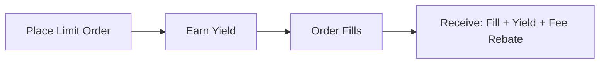

# Trading Fees & Costs

GTX DEX implements a transparent and competitive fee structure designed to maximize trader profitability while ensuring sustainable yield generation.

## Fee Structure Overview

<CardGroup cols={2}>
  <Card
    title="Maker Fees"
    icon="hand-holding-dollar"
  >
    **0.10%** - When you provide liquidity to the order book
  </Card>
  <Card
    title="Taker Fees"
    icon="hand-coins"
  >
    **0.20%** - When you remove liquidity from the order book
  </Card>
</CardGroup>

## Fee Categories

### Trading Fees

| Order Type | Fee Rate | Who Pays | Example |
|------------|----------|----------|---------|
| **Maker** (Limit orders that don't execute immediately) | 0.10% | Order placer | Place buy at $2500, market at $2510 |
| **Taker** (Market orders or aggressive limit orders) | 0.20% | Order placer | Market buy when best ask is $2500 |

### Additional Costs

| Cost Type | Amount | Notes |
|-----------|--------|-------|
| **Deposit** | Gas fees only | No platform fees |
| **Withdrawal** | Gas fees only | No platform fees |
| **Order Placement** | Gas fees only | No platform fees |
| **Order Cancellation** | Gas fees only | No platform fees |

<Note>
GTX DEX charges no deposit, withdrawal, or order management fees beyond standard blockchain gas costs.
</Note>

## Maker vs Taker Explained

Understanding the difference between maker and taker orders is crucial for optimizing your trading costs:

### Maker Orders 💡
**Add liquidity to the order book**

<Tabs>
  <Tab title="Example Scenario">
    **Current Market**: ETH/USDC at $2500 bid, $2510 ask
    
    **Your Action**: Place limit buy order at $2495
    
    **Result**: 
    - Your order sits in the order book
    - You're "making" liquidity available
    - **Fee**: 0.10% when filled
    - **Yield**: Earn while waiting for execution
  </Tab>
  
  <Tab title="Benefits">
    - Lower fees (0.10%)
    - Earn yield while waiting
    - Better price control
    - Potential fee rebates
    - Help market efficiency
  </Tab>
</Tabs>

### Taker Orders 🚀  
**Remove liquidity from the order book**

<Tabs>
  <Tab title="Example Scenario">
    **Current Market**: ETH/USDC at $2500 bid, $2510 ask
    
    **Your Action**: Market buy order (or limit buy at $2510+)
    
    **Result**:
    - Your order executes immediately
    - You're "taking" existing liquidity  
    - **Fee**: 0.20% on execution
    - **Yield**: None (immediate execution)
  </Tab>
  
  <Tab title="Use Cases">
    - Need immediate execution
    - High volatility situations
    - Arbitrage opportunities
    - Urgent position changes
    - Stop-loss execution
  </Tab>
</Tabs>

## Fee Calculation Examples

### Maker Fee Example
```javascript
// Limit order that provides liquidity
Order: Buy 2.0 ETH at $2480 (market at $2500)
Execution: Order fills when price drops to $2480

Trade Value: 2.0 ETH × $2480 = $4,960
Maker Fee: $4,960 × 0.10% = $4.96
Net Cost: $4,960 + $4.96 = $4,964.96

// Plus yield earned while order was open!
```

### Taker Fee Example  
```javascript
// Market order that removes liquidity
Order: Market buy 2.0 ETH (current ask $2510)
Execution: Immediate at $2510

Trade Value: 2.0 ETH × $2510 = $5,020  
Taker Fee: $5,020 × 0.20% = $10.04
Net Cost: $5,020 + $10.04 = $5,030.04

// No yield opportunity (immediate execution)
```

## Yield Generation

### How Yield Works with Trading

GTX DEX's unique yield mechanism means your trading positions generate returns:

#### For Limit Orders (Makers)


#### Yield Sources
<AccordionGroup>
  <Accordion title="Base Yield Rate">
    **Variable APY based on market conditions**
    
    - Calculated on order value while open
    - Compounds continuously
    - Higher rates during high-activity periods
    
    ```javascript
    // Example yield calculation
    Order Value: $10,000
    Time Open: 24 hours
    Base Yield Rate: 5% APY
    
    Daily Yield: $10,000 × (5% / 365) = $1.37
    ```
  </Accordion>
  
  <Accordion title="Trading Fee Rebates">
    **Portion of trading fees returned to makers**
    
    - Up to 50% of maker fees returned
    - Based on trading volume and frequency
    - Paid in GTX tokens or base currency
    
    ```javascript
    // Fee rebate example
    Maker Fee Paid: $10.00
    Rebate Rate: 30%
    Rebate Received: $3.00
    
    Net Fee: $10.00 - $3.00 = $7.00
    ```
  </Accordion>
  
  <Accordion title="Protocol Rewards">
    **GTX token emissions for active traders**
    
    - Distributed based on trading activity
    - Higher rewards for consistent makers
    - Bonus multipliers during promotional periods
    
    ```javascript
    // Weekly GTX rewards example
    Trading Volume: $100,000
    GTX Price: $2.50
    Reward Rate: 0.01% of volume
    
    GTX Earned: ($100,000 × 0.01%) / $2.50 = 4 GTX tokens
    ```
  </Accordion>
</AccordionGroup>

## Fee Optimization Strategies

### Strategy 1: Maximize Maker Orders

<Steps>
  <Step title="Study the Spread">
    Place orders between bid and ask to increase fill probability
  </Step>
  <Step title="Use Limit Orders">
    Avoid market orders unless urgency requires immediate execution
  </Step>
  <Step title="Be Patient">
    Let orders sit longer to earn more yield before fills
  </Step>
  <Step title="Monitor Markets">
    Adjust prices as market moves to maintain competitiveness
  </Step>
</Steps>

### Strategy 2: Timing Optimization

```javascript
// Peak trading hours (higher yield rates)
const peakHours = [8, 9, 10, 16, 17, 18]; // EST
const currentHour = new Date().getHours();

if (peakHours.includes(currentHour)) {
  // Place limit orders during high-activity periods
  // Higher chance of yield generation
  placeLimitOrder({
    price: marketPrice * 0.999, // Close to market
    timeInForce: "GTC"
  });
}
```

### Strategy 3: Volume-Based Discounts

Higher trading volumes may qualify for reduced fees:

| Monthly Volume | Maker Fee | Taker Fee | Rebate Rate |
|----------------|-----------|-----------|-------------|
| < $10,000 | 0.10% | 0.20% | 0% |
| $10,000 - $50,000 | 0.08% | 0.18% | 10% |
| $50,000 - $100,000 | 0.06% | 0.16% | 20% |
| $100,000+ | 0.05% | 0.15% | 30% |

<Note>
Volume tiers are calculated monthly and reset at the beginning of each month.
</Note>

## Gas Optimization

### Efficient Order Management

Since each blockchain transaction requires gas, optimize your order patterns:

#### Batch Operations
```javascript
// Instead of multiple single orders
await gtx.placeOrder(order1); // Gas: ~50,000
await gtx.placeOrder(order2); // Gas: ~50,000  
await gtx.placeOrder(order3); // Gas: ~50,000
// Total: ~150,000 gas

// Use batch placement when available  
await gtx.batchPlaceOrders([order1, order2, order3]); 
// Total: ~80,000 gas (savings: ~70,000 gas)
```

#### Order Lifecycle Management
```javascript
// Efficient order management
const strategy = {
  // Place longer-term orders to reduce gas frequency
  timeInForce: "GTC",
  
  // Use competitive pricing to increase fill probability
  price: calculateOptimalPrice(market),
  
  // Batch cancellations when reshuffling portfolio
  batchCancel: true
};
```

## Fee Transparency

### Real-Time Fee Calculation

GTX DEX provides transparent fee calculation:

```javascript
// Get current fee rates
const feeRates = await gtx.getFeeRates();
console.log("Maker fee:", feeRates.maker); // 0.001 (0.10%)
console.log("Taker fee:", feeRates.taker); // 0.002 (0.20%)

// Calculate fees before trading
const orderValue = quantity * price;
const estimatedFee = orderValue * (isMaker ? feeRates.maker : feeRates.taker);

console.log(`Estimated fee: $${estimatedFee.toFixed(2)}`);
```

### Fee History Tracking

Monitor your fee efficiency:

```javascript
// Analyze your fee performance
const feeStats = await gtx.getUserFeeStats(userAddress);

console.log("Total fees paid:", feeStats.totalFees);
console.log("Maker/Taker ratio:", feeStats.makerRatio); 
console.log("Fee rebates earned:", feeStats.rebatesEarned);
console.log("Effective fee rate:", feeStats.effectiveRate);
```

## Comparison with Other Exchanges

| Exchange | Maker Fee | Taker Fee | Yield Generation | Order Types |
|----------|-----------|-----------|------------------|-------------|
| **GTX DEX** | 0.10% | 0.20% | ✅ Continuous | Limit, Market |
| Uniswap V3 | N/A | 0.30%+ | ❌ LP only | Swap only |
| dYdX | 0.05% | 0.55% | ❌ None | All types |
| Binance CEX | 0.10% | 0.10% | ❌ None | All types |

<Info>
GTX DEX is the only decentralized exchange that combines competitive fees with continuous yield generation on trading positions.
</Info>

## Cost Calculation Tools

### Order Cost Calculator

```javascript
function calculateTradingCost(params) {
  const { quantity, price, orderType, timeOpen = 0 } = params;
  
  const orderValue = quantity * price;
  const isMaker = orderType === "LIMIT";
  
  // Trading fee
  const feeRate = isMaker ? 0.001 : 0.002; // 0.1% vs 0.2%
  const tradingFee = orderValue * feeRate;
  
  // Potential yield (for makers)
  const yieldRate = 0.05; // 5% APY
  const dailyYield = isMaker ? orderValue * (yieldRate / 365) * (timeOpen / 24) : 0;
  
  // Gas estimate
  const gasPrice = 20; // gwei
  const gasUsed = 50000;
  const gasCost = (gasPrice * gasUsed) / 1e9 * 2500; // ETH price $2500
  
  return {
    tradingFee,
    potentialYield: dailyYield,
    gasCost,
    netCost: tradingFee + gasCost - dailyYield
  };
}

// Example usage
const cost = calculateTradingCost({
  quantity: 2.0,
  price: 2500,
  orderType: "LIMIT", 
  timeOpen: 12 // hours
});

console.log("Trading fee:", cost.tradingFee);
console.log("Potential yield:", cost.potentialYield);
console.log("Net cost:", cost.netCost);
```

---

<Warning>
**Important Notes:**
- Yield rates are variable and not guaranteed
- Gas costs depend on network congestion
- Fee rebates are subject to volume requirements
- All costs are estimates and may vary
</Warning>

Ready to start trading with optimized costs? Understanding GTX DEX's fee structure helps you maximize profitability while earning yield on every position.