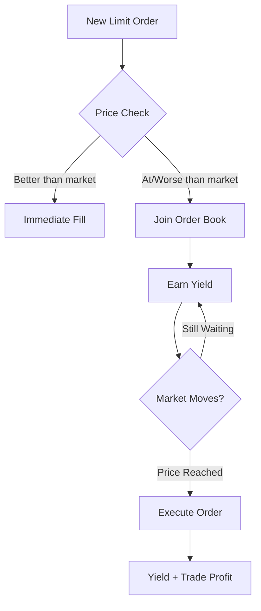

# Order Types on GTX DEX

GTX DEX supports professional-grade order types designed for both retail and institutional traders. Every order type is optimized to generate yield while providing precise execution control.

## Market Orders

Execute trades immediately at the best available market price.

### How Market Orders Work

Market orders prioritize speed over price control:

1. **Immediate Execution** - Order executes against existing liquidity
2. **Price Taking** - You pay the current ask (buy) or receive current bid (sell)
3. **No Yield Period** - Executes instantly, no yield accumulation time

### When to Use Market Orders

<CardGroup cols={2}>
  <Card
    title="Urgent Execution"
    icon="zap"
  >
    When you need immediate entry or exit from a position
  </Card>
  <Card
    title="High Liquidity Markets"
    icon="waves"
  >
    In deep markets where price impact is minimal
  </Card>
</CardGroup>

### Market Order Example

```javascript
// Buy 1.5 ETH at current market price
{
  type: "MARKET",
  side: "BUY", 
  quantity: "1.5",
  symbol: "ETHUSDC"
}

// Expected execution: Immediate at best ask price
// Yield generation: None (instant execution)
```

### Advantages & Disadvantages

| ✅ Advantages | ❌ Disadvantages |
|---------------|------------------|
| Immediate execution | No price control |
| Guaranteed fill | Potential slippage |
| Simple to use | Higher effective cost |

---

## Limit Orders

Execute trades only at your specified price or better, while earning yield.

### How Limit Orders Work

Limit orders provide price control and yield generation:

1. **Price Control** - Sets maximum buy price or minimum sell price
2. **Queue Position** - Joins order book at specified price level
3. **Yield Accrual** - Earns yield while waiting for execution
4. **Partial Fills** - Can execute in portions as liquidity becomes available

### When to Use Limit Orders

<CardGroup cols={3}>
  <Card
    title="Price Discipline"
    icon="target"
  >
    When you have a specific target price in mind
  </Card>
  <Card
    title="Yield Generation"
    icon="coins"
  >
    To earn returns while waiting for execution
  </Card>
  <Card
    title="Market Making"
    icon="balance-scale"
  >
    To provide liquidity and earn trading fees
  </Card>
</CardGroup>

### Limit Order Examples

<Tabs>
  <Tab title="Buy Limit">
    ```javascript
    // Buy 2.0 ETH at $2400 or lower
    {
      type: "LIMIT",
      side: "BUY",
      quantity: "2.0", 
      price: "2400.00",
      symbol: "ETHUSDC"
    }
    
    // Yield earnings while order is open:
    // - Base yield rate on position value
    // - Potential maker fee rebates
    // - Protocol reward tokens
    ```
  </Tab>
  
  <Tab title="Sell Limit">
    ```javascript
    // Sell 1.0 ETH at $2600 or higher  
    {
      type: "LIMIT",
      side: "SELL",
      quantity: "1.0",
      price: "2600.00", 
      symbol: "ETHUSDC"
    }
    
    // Yield earnings while order is open:
    // - Yield on ETH position
    // - Trading fee rebates if executed
    // - GTX token rewards
    ```
  </Tab>
</Tabs>

### Limit Order Execution Priority

Orders execute based on **Price-Time Priority**:

1. **Best Price First** - Higher bids and lower asks get priority
2. **Time Priority** - Among same price, earlier orders execute first
3. **Pro-Rata** - Large orders may split execution fairly



---

## Order Management

### Order Status Types

| Status | Description | Yield Earning |
|--------|-------------|---------------|
| `NEW` | Order submitted, not yet in book | ❌ |
| `OPEN` | Active in order book | ✅ |
| `PARTIALLY_FILLED` | Partially executed | ✅ (on remaining) |
| `FILLED` | Completely executed | ❌ |
| `CANCELLED` | Cancelled by user | ❌ |

### Modifying Orders

<AccordionGroup>
  <Accordion title="Cancel Orders">
    Remove orders from the order book:
    
    ```javascript
    // Cancel specific order
    await gtx.cancelOrder(orderId);
    
    // Cancel all orders for symbol
    await gtx.cancelAllOrders("ETHUSDC");
    ```
    
    **Note**: Yield stops accruing immediately upon cancellation
  </Accordion>
  
  <Accordion title="Replace Orders">
    Modify price or quantity:
    
    ```javascript
    // Cancel and replace with new parameters
    await gtx.replaceOrder(orderId, {
      price: "2550.00",
      quantity: "1.5"
    });
    ```
    
    **Note**: Replacement creates new order, losing time priority
  </Accordion>
</AccordionGroup>

## Advanced Order Strategies

### Iceberg Orders

Break large orders into smaller chunks to avoid market impact:

```javascript
// Large order split into smaller pieces
{
  type: "ICEBERG",
  side: "BUY",
  totalQuantity: "10.0",
  visibleQuantity: "1.0", // Only show 1.0 at a time
  price: "2500.00",
  symbol: "ETHUSDC"
}
```

**Benefits**:
- Reduced market impact
- Maintain yield on entire position
- Hide trading intentions

### Time-in-Force Options

Control how long orders remain active:

| Type | Description | Yield Impact |
|------|-------------|--------------|
| `GTC` | Good Till Cancelled | Maximum yield time |
| `IOC` | Immediate or Cancel | Minimal yield opportunity |
| `FOK` | Fill or Kill | No yield (instant decision) |

### Market Making Strategies

#### Spread Trading
```javascript
// Place both buy and sell orders
const buyOrder = {
  type: "LIMIT",
  side: "BUY", 
  quantity: "1.0",
  price: "2495.00", // Below market
  symbol: "ETHUSDC"
};

const sellOrder = {
  type: "LIMIT", 
  side: "SELL",
  quantity: "1.0", 
  price: "2505.00", // Above market
  symbol: "ETHUSDC"
};

// Earn yield on both orders + spread profit when filled
```

#### Dynamic Pricing
```javascript
// Adjust orders based on market conditions
setInterval(async () => {
  const ticker = await gtx.getTicker("ETHUSDC");
  const midPrice = (ticker.bid + ticker.ask) / 2;
  
  // Update orders around mid price
  await gtx.replaceOrder(buyOrderId, {
    price: (midPrice * 0.999).toFixed(2) // 0.1% below mid
  });
  
  await gtx.replaceOrder(sellOrderId, {
    price: (midPrice * 1.001).toFixed(2) // 0.1% above mid  
  });
}, 5000); // Update every 5 seconds
```

## Order Book Interaction

### Reading the Order Book

```javascript
// Get current order book depth
const depth = await gtx.getOrderBook("ETHUSDC", 10);

console.log("Best Bid:", depth.bids[0]); // [price, quantity]
console.log("Best Ask:", depth.asks[0]); // [price, quantity]

// Calculate spread
const spread = depth.asks[0][0] - depth.bids[0][0];
console.log("Spread:", spread);
```

### Understanding Market Impact

```javascript
// Calculate potential market impact
function estimateMarketImpact(orderBook, side, quantity) {
  const orders = side === "BUY" ? orderBook.asks : orderBook.bids;
  let remaining = quantity;
  let totalCost = 0;
  
  for (const [price, available] of orders) {
    const fillQty = Math.min(remaining, available);
    totalCost += fillQty * price;
    remaining -= fillQty;
    
    if (remaining <= 0) break;
  }
  
  const avgPrice = totalCost / (quantity - remaining);
  const marketPrice = orders[0][0];
  const impact = Math.abs(avgPrice - marketPrice) / marketPrice;
  
  return { avgPrice, impact: impact * 100 }; // Impact as percentage
}
```

## Best Practices

### For Maximum Yield

<Steps>
  <Step title="Use Limit Orders">
    Prefer limit orders over market orders to earn yield while waiting
  </Step>
  <Step title="Set Competitive Prices">
    Price orders close to market for higher execution probability
  </Step>
  <Step title="Monitor Markets">
    Adjust orders as market conditions change
  </Step>
  <Step title="Diversify Timeframes">
    Mix short-term and long-term orders for consistent yield
  </Step>
</Steps>

### For Better Execution

- **Check Liquidity** - Review order book depth before large orders
- **Avoid Round Numbers** - Use prices like 2501.50 instead of 2500.00
- **Time Your Orders** - Place during high-liquidity periods
- **Monitor Fills** - Watch for partial executions and adjust accordingly

### Risk Management

<Warning>
**Order Risks to Consider:**
- Limit orders may never execute if price doesn't reach your level
- Market orders can experience slippage in volatile conditions  
- Yield is not guaranteed and varies based on market conditions
- Always monitor positions and market conditions
</Warning>

## Order Examples by Scenario

### Conservative Trading
```javascript
// Conservative approach: Close to market prices
{
  type: "LIMIT",
  side: "BUY",
  quantity: "1.0", 
  price: currentAsk * 0.995, // 0.5% below ask
  symbol: "ETHUSDC"
}
```

### Aggressive Trading
```javascript
// Aggressive approach: Further from market  
{
  type: "LIMIT",
  side: "BUY",
  quantity: "1.0",
  price: currentAsk * 0.98, // 2% below ask
  symbol: "ETHUSDC"  
}
```

### Yield Optimization
```javascript
// Maximum yield: Patient orders
{
  type: "LIMIT", 
  side: "BUY",
  quantity: "5.0",
  price: currentAsk * 0.95, // 5% below ask
  symbol: "ETHUSDC",
  timeInForce: "GTC" // Keep earning until filled
}
```

---

<Info>
Every order type on GTX DEX is designed to maximize your trading efficiency while generating yield. Choose the right order type based on your strategy, risk tolerance, and yield objectives.
</Info>