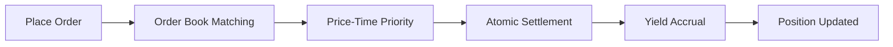

# Trading on GTX DEX

GTX DEX revolutionizes decentralized trading by combining the efficiency of Central Limit Order Book (CLOB) with **continuous yield generation**. Unlike traditional exchanges where your capital sits idle, GTX ensures every moment your assets are working for you.

## Why GTX DEX Trading is Different

<CardGroup cols={2}>
  <Card
    title="Earn Yield While Trading"
    icon="coins"
  >
    Generate returns on your trading positions automatically - no idle capital
  </Card>
  <Card
    title="CLOB Efficiency"
    icon="chart-line"
  >
    Professional order book trading with precise price discovery and execution
  </Card>
  <Card
    title="No Impermanent Loss"
    icon="shield-check"
  >
    Direct peer-to-peer trading eliminates liquidity provider risks
  </Card>
  <Card
    title="Open Markets"
    icon="globe"
  >
    Create any trading pair without restrictions
  </Card>
</CardGroup>

## How Trading Works

### 1. **Order Book System**

GTX uses a sophisticated CLOB architecture:

- **Red-Black Tree Price Levels** - O(log n) operations for efficient price management
- **FIFO Order Queues** - Fair execution within each price level
- **Atomic Settlements** - Secure and consistent trade execution
- **Real-time Updates** - Live order book data and trade notifications

### 2. **Yield Generation**

Every trade on GTX generates yield through multiple mechanisms:

#### 🔄 **Active Trading Yield**
- Earn yield on open limit orders while waiting for execution
- No opportunity cost for holding trading positions
- Continuous compounding of returns

#### 💎 **Trading Fee Rewards**
- Collect a portion of trading fees from successful orders
- Maker rebates for providing liquidity
- Volume-based fee tier reductions

#### 🏆 **Protocol Incentives**
- Earn GTX tokens through trading participation
- Bonus rewards for early adopters
- Special incentives for market makers

### 3. **Order Execution**

GTX provides institutional-grade order execution:



## Trading Features

### Order Types

<AccordionGroup>
  <Accordion title="Market Orders">
    **Execute immediately at the best available price**
    
    - Instant execution against existing liquidity
    - No guarantee on execution price
    - Ideal for urgent trades
    
    ```javascript
    // Example market order
    {
      type: "MARKET",
      side: "BUY",
      quantity: "1.5",
      symbol: "ETHUSDC"
    }
    ```
  </Accordion>
  
  <Accordion title="Limit Orders">
    **Execute only at your specified price or better**
    
    - Control over execution price
    - Earn yield while order is open
    - May not execute if price isn't reached
    
    ```javascript
    // Example limit order
    {
      type: "LIMIT",
      side: "SELL", 
      quantity: "2.0",
      price: "2500.00",
      symbol: "ETHUSDC"
    }
    ```
  </Accordion>
</AccordionGroup>

### Advanced Features

#### Price-Time Priority
Orders are executed based on:
1. **Price** - Best prices get priority
2. **Time** - Earlier orders at same price execute first

#### Partial Fills
- Large orders can be partially filled
- Remaining quantity stays active in order book
- Yield continues to accrue on unfilled portion

#### Order Management
- Real-time order status updates
- Easy cancellation and modification
- Complete order history tracking

## Trading Interface

### Web Application
Access the full trading interface at [gtxdex.xyz/trading](https://gtxdex.xyz/trading):

- **Professional Charts** - TradingView integration with technical analysis
- **Real-time Order Book** - Live depth and spread information  
- **Portfolio Dashboard** - Track positions, P&L, and yield
- **Order Management** - Place, modify, and cancel orders easily

### API Trading
For algorithmic and programmatic trading:

- **REST API** - Complete market data and order management
- **WebSocket Feeds** - Real-time price and order updates
- **Rate Limits** - 1200 requests/minute for market data
- **Order Management** - 300 requests/minute for user operations

## Supported Markets

GTX DEX currently supports spot trading for:

### Major Pairs
- **ETH/USDC** - Ethereum vs USD Coin
- **WBTC/USDC** - Wrapped Bitcoin vs USD Coin  
- **LINK/USDC** - Chainlink vs USD Coin

### Meme Tokens
- **PEPE/USDC** - PEPE vs USD Coin
- **FLOKI/USDC** - Floki vs USD Coin
- **SHIB/USDC** - Shiba Inu vs USD Coin

### Custom Markets
Create new trading pairs:
- Any ERC-20 token can be listed
- Community-driven market creation
- No approval process required

## Getting Started

<Steps>
  <Step title="Connect Wallet">
    Connect your Web3 wallet (MetaMask, WalletConnect, etc.) to start trading
  </Step>
  <Step title="Deposit Funds">
    Deposit tokens directly or use cross-chain bridges for multi-chain assets
  </Step>
  <Step title="Start Trading">
    Place your first order and begin earning yield automatically
  </Step>
  <Step title="Monitor Yields">
    Track your trading performance and yield generation in real-time
  </Step>
</Steps>

## Trading Strategies

### Market Making
- Place both buy and sell orders around current price
- Earn spread profits plus yield on open orders
- Benefit from trading fee rebates

### Trend Trading  
- Use technical analysis to identify trends
- Earn yield on stop orders and position holds
- Leverage GTX's efficient execution

### Arbitrage
- Exploit price differences across exchanges
- Fast execution with CLOB efficiency
- Yield generation during position holds

## Fees & Costs

| Fee Type | Maker | Taker |
|----------|-------|-------|
| Trading Fee | 0.10% | 0.20% |
| Yield Rate | Variable | Variable |
| Withdrawal | Gas only | Gas only |

<Note>
Maker fees may be reduced or rebated based on trading volume and yield generation performance.
</Note>

## Security Features

### Smart Contract Security
- **Audited Contracts** - Multiple security audits completed
- **Access Controls** - Proper permission management
- **Reentrancy Protection** - All state-changing functions secured

### User Security
- **Non-custodial** - You control your private keys
- **No KYC Required** - Open access
- **Transparent** - All transactions on-chain

## Next Steps

<CardGroup cols={3}>
  <Card
    title="Start Trading"
    icon="play"
    href="https://gtxdex.xyz/trading"
  >
    Launch the trading interface
  </Card>
  <Card
    title="Order Types Guide"
    icon="list"
    href="/trading/order-types"
  >
    Learn about different order types
  </Card>
  <Card
    title="API Trading"
    icon="code"
    href="/api-reference/introduction"
  >
    Algorithmic trading documentation
  </Card>
</CardGroup>

---

<Info>
Ready to start earning yield while you trade? GTX DEX makes every trade a yield-generating opportunity.
</Info>